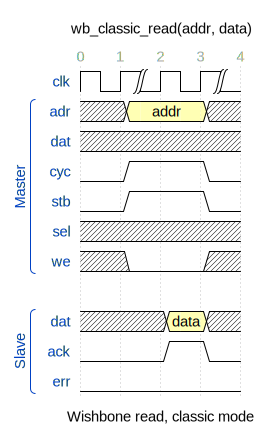

.. _drom2psl:

drom2psl
========

``drom2psl`` is a helper tool of FVM that converts wavedrom waveforms, in JSON
format, into PSL files that include sequences and (depending on the number of
sequences defined in the JSON file) properties.

In order for this helper tool to have maximum usefulnes, we are assuming a
number of things in the input .json files:

1. That the clock is the first signal that appears in the JSON description
2. That only the clock carries the repeat zero-or-more symbol, which is
   represented by ``|`` in the JSON file and by two curved lines in the
   generated ``.svg`` file. When the clock signal has this value, that means
   that the specific values of the other signals repeat for zero or more clock
   cycles. This can be combined with standard clock signal values to create
   other repetition patterns such as '1 or more', '2 or more', etc.
3. That the user has defined the datatype of any 'data' in a 'type' field in
   the wavelane, for example:

   .. code-block::

      {name: 'dat', wave: 'x.3x', data: 'data', type: 'std_ulogic_vector(31 downto 0)'},

   It must be noted that, while the ``type`` field is not considered by
   wavedrom, it is compatible with it, meaning that JSON files that include
   this field can rendered by wavedrom normally.

3. That each top-level signal group is being used to group signals that take
   part in the same sequence. So, every top-level group defines a sequence. If
   there are no toplevel groups, a single sequence will be defined that
   includes all the signals.
4. That, if we have exactly two top-level groups, then we are describing some
   relation between two sequences and thus a sample property will be generated
   in the PSL file relating the two sequences. For this:

   - If the first group is called ``Precond`` and the second ``Cond``, the
     property will relate the two sequences using the overlapping implication
     operator, ``|->``.
   - If the first group is called ``Precond`` and the second
     ``Cond_non_overlap``, the property will relate the two sequences using the
     non-overlapping implication operator, ``|=>``.
   - Else, the property will relate the sequences using the "both must happen
     at the same time and last exactly the same number of cycles" operator,
     ``&&``.

For example, the following waveform is compliant with the aforementioned
assumptions, and defines two signal groups, *Master* and *Slave*:

The following subsections explain the three ways in which the ``drom2psl`` tool
can be used:

Adding drom sources
-------------------

The functions :py:func:`fvm.FvmFramework.add_drom_source` and
:py:func:`fvm.FvmFramework.add_drom_sources` allow to respectively add
one or multiple wavedrom sources, in JSON format, to an FVM project.

This is the recommended way of working with wavedrom sources if no
modifications are needed on the generated PSL outputs.

During the *setup* stage of the FVM framework, all the drom sources will be
converted to PSL files, which will be included in the generated scripts for the
``prove`` step.

.. autofunction:: fvm.FvmFramework.add_drom_source

.. autofunction:: fvm.FvmFramework.add_drom_sources

Manually running drom2psl
-------------------------

Alternatively, the user can just run the ``drom2psl`` executable to:

.. argparse::
   :module: fvm.drom2psl.generator
   :func: create_parser
   :prog: drom2psl

Calling the drom2psl.generator function
---------------------------------------

The third way of invoking ``drom2psl`` is by calling the
:py:func:`fvm.drom2psl.generator.generator` function from any python
script:

.. autofunction:: fvm.drom2psl.generator.generator

