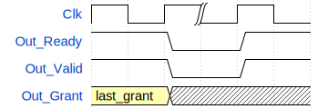

.. _examples:

Repository of Examples
======================================

The repository of examples is really nice. In this section we explain some
important things about each example, but everything is found in detail and
with explanatory comments in the code of each example.

Suggested order
---------------

Trivial examples
----------------

The first trivial example was the counter in :ref:`firstexample`.

Dualcounter
~~~~~~~~~~~

This dualcounter compares whether the most significant bit of two counters
is equal and shows the result in the output ``equalmsb``. In the
``reachability`` step, we can see that the ``equalmsb = '0'`` toggle is
unreachable, so we know that the output of this dualcounter will always be
correct.

Priority Arbiter
~~~~~~~~~~~~~~~~

This example shows a simple priority arbiter from the Open Logic library:
https://github.com/open-logic/open-logic. In this example, many things can
be checked simply with assertions, for example, that the output always has 0
or 1 bit asserted; that if there is no request, the output is 0; that if there
is a request, the output is onehot... Additionally, to fully test the
functionality, we can create a function that checks if the arbiter result is
correct (this can be done either in the PSL file or in a VHDL package, although
the latter is more recommended).

Round Robin Arbiter
~~~~~~~~~~~~~~~~~~~

This example also belongs to the OpenLogic library. Again, it's a simple
example, and some of the priority arbiter's priorities can be reused. However,
this case is more complicated due to the round-robin algorithm and the control
logic, which requires a handshake. We can define a sequence for the handshake
since it will be reused quite a bit.

Again, it's very convenient to define a function with round-robin behavior,
since it's very simple. Let's try creating a sequence with `drom2psl`.
We want to ensure that if there has been a valid grant before, the next grant
(whenever it happens) will be successful. The function that predicts the round
robin needs the request and the last grant as inputs.

This is the generated PSL:

.. code-block:: vhdl

   vunit last_valid_grant {

   sequence last_valid_grant (
      hdltype std_logic_vector(63 downto 0) last_grant
   ) is {
      ((Out_Ready = '1') and (Out_Valid = '1') and (Out_Grant = last_grant))[*1];  -- 1 cycle
      ((Out_Ready = '0') and (Out_Valid = '0'))[*];  -- 0 or more cycles
      ((Out_Ready = '1') and (Out_Valid = '1'))[*1]  -- 1 cycle
   };

   }

.. attention::
   The second line of the sequence: `((Out_Ready = '0') and (Out_Valid = '0'))[*]`
   is more convenient to express with an ``or``, because it also includes the case
   where either of the two is equal to 1. However, that cannot be represented
   with `drom2psl`, so it must be added manually.

With this, we can ensure that if we have a grant and then we have another (it
can happen in any possible cycle), the grant will be equal to the function
that predicts it. We can verify that the property holds true for all possible
values by creating a symbolic constant ``last_grant``.

.. code-block:: vhdl

   assert always ( {last_valid_grant(last_grant)} |->
                   {Out_Grant = round_robin_arbiter(In_Req, last_grant) } ) abort Rst;

Easy examples
--------------

UART transmitter
~~~~~~~~~~~~~~~~

This example is still simple, but it already includes a state machine,
albeit one with very linear behavior. In this example, we can see how covers
can be very useful for several reasons: exploring the different states of
a state machine, validating functionality with a cover of the transmission,
or early design learning by making a cover with the final result.

.. code-block:: vhdl

   cover_start_of_transmission: 
      cover {state = b_start};

   sequence transmission is {
      TX=STARTBIT[*5];
      TX=databits(0)[*5]; TX=databits(1)[*5];
      TX=databits(2)[*5]; TX=databits(3)[*5];
      TX=databits(4)[*5]; TX=databits(5)[*5];
      TX=databits(6)[*5]; TX=databits(7)[*5];
      TX=paritybit[*5]; TX=STOPBIT[*5]
   };

   cover_one_transmission:
      cover transmission;

   cover_end_of_transmission: 
      cover {state = b_stop; state = reposo};

Axi-4 Lite Slave
~~~~~~~~~~~~~~~~~

This Axi Slave has a state machine that is no longer as linear (it has both
TX and RX) and also has quite a few interfaces. This makes writing sequences
for reuse more important, both in terms of speed and clarity. The code snippet
shows how code can be reused and made more readable for writing:

.. code-block:: vhdl

   sequence W_handshake is {                                                   
      S_AxiLite_WValid = '1' and S_AxiLite_WReady = '1'
   };

   sequence W_interface (
      hdltype std_logic Wr;
      hdltype std_logic_vector(AxiDataWidth_g - 1 downto 0) WrData;
      hdltype std_logic_vector((AxiDataWidth_g/8) - 1 downto 0) ByteEna
      ) is {                                                                        
      Rb_Wr = Wr and 
      Rb_WrData = WrData and 
      Rb_ByteEna = ByteEna 
   };

   assert_W_after_handshake: 
      assert always ( {W_handshake} |=> 
                      {W_interface('1', prev(S_AxiLite_WData), prev(S_AxiLite_WStrb))}
                     ) abort Rst;

Medium examples
---------------

SDRAM controller
~~~~~~~~~~~~~~~~

This is the first example where complexity reduction techniques can be applied,
although it's quite easy. There's a startup delay of over 2000 cycles
parameterized with a generic, so it can simply be reduced without affecting
the design at all, as it's just a startup delay. Regarding the design, it's
similar to the Axi slave with many states (``WRITE``, ``READ``, ``REFRESH``...)
and many interfaces, so using sequences remains essential.

Linear interpolator
~~~~~~~~~~~~~~~~~~~~

This example will be the first where assumptions are crucial.
If the input ``valid`` is asserted, the ``inferior`` and ``superior`` inputs
are interpolated for 12 cycles. We must ensure that if ``valid`` is asserted,
the ``superior`` and ``inferior`` inputs remain stable during the 12
interpolation cycles. Similarly, if ``valid`` is asserted, it will not be
re-asserted in the next 12 cycles.

.. code-block:: vhdl

   -- Assume inferior and superior do not change during the 12 cycles output
   assume always ({valid} |=> {stable(inferior)[*12]}) abort rst;
   assume always ({valid} |=> {stable(superior)[*12]}) abort rst;

   -- Assume the interpolator will not be activated on the 12 cycles after
   -- being activated (the interpolator needs 12 cycles to output the 12
   -- interpolated data)
   assume_not_activated_when_interpolating:
      assume always {valid} |=> {(not valid)[*12]};

In addition to this, this example is the first with some computational
complexity, due to its 10-bit by 5-bit multipliers. This will cause the
property we use to check the design's functionality to take more than 15
minutes (and that's only because the multipliers aren't even that large).
The property checks that if the input is valid, the output will be correct
for the next 12 cycles.

However, we could reduce the complexity using property simplification by
adding 12 properties where the first property checks that if the input is
valid, the first output cycle is correct; the second property checks that
if the input is valid, the second output cycle is correct; and so on. This
way, these 12 properties simplify the original property without losing any
functionality. The 12 properties take less than 1.5 minutes to prove.

Synchronous FIFO
~~~~~~~~~~~~~~~~~

This example is one of the most important, since FIFOs and memories are a
recurring element in most designs, and will be responsible for a large part
of their difficulty.

First, we need to understand why memory complicates our designs so much.
Taking the example of a relatively small memory, 256x8 bits, that already
gives us 2048 state bits, which is quite a lot in itself. Furthermore,
with 256 memory locations, if it's accessed once per cycle, it will take at
least 256 cycles for the properties to verify that all memory locations are
accessible, resulting in high latency. In fact, memory locations are often
more detrimental due to the latency they generate than the data size, since
the latter can be simplified by using symbolic constants.

The section :ref:`complexityreduction` offers several tips for
dealing with memory. The PSL code for this FIFO also reveals which techniques
are used.

Intermediate examples
----------------------

32-bit divider
~~~~~~~~~~~~~~~

This case presents enormous computational complexity: a 64-bit dividend
divided by a 32-bit divisor. This will make it impossible to verify data
integrity for all combinations (2\ :sup:`96`), just as it would be impossible
to do so with simulation.

Therefore, to verify data integrity, we need to reduce the state space,
that is, the possible combinations. The best way to do this is to use
assumptions, although it would be advisable for the assumptions to occupy
random bins so that different values are used during different executions.
With 2\ :sup:`24` combinations, the property takes 1 hour. With 2\ :sup:`21`
combinations, it takes 10 minutes.

.. code-block:: vhdl

   -- We can assume some bits are always constant, although we should
   -- randomize it for different executions
   assume always ( divi.y(29 downto 20) = "0101010101" );
   assume always ( divi.op1(29 downto 20) = "1101011010" );
   assume always ( divi.op2(29 downto 20) = "0100001110" );

   -- Or we can directly assume ranges
   assume always ( 10000 > signed(divi.y) >= -10000);
   assume always ( 20000 > signed(divi.op1) >= 0);

Asynchronous FIFO
~~~~~~~~~~~~~~~~~

If we specify the clock and reset domains in ``formal.py``, the steps
``resets`` and ``clocks`` are very useful for checking clock and reset
domain crossing.

Regarding FIFO handling, it's the same as synchronous FIFO. The difference
lies in the clocks. Until now, we defined the default clock at the top of the
PSL file, and all properties used that clock. Now we'll have to define the
clock in each property (although PSL allows for more than one clock in a
property, it's not recommended, and most tools probably won't support it):

.. code-block:: vhdl

   -- Assert the FIFO level calculated on the write side is always
   -- less than the depth of the FIFO
   assert_in_level_within_bounds:
      assert always ( (unsigned(In_Level) <= Depth_g) abort In_Rst) @rising_edge(In_Clk);

So, what do we do if we want a property that relates signals from different
clock domains? Well, we can pass either of the two signals through a
synchronizer (it can be a single-stage synchronizer because in formal
verification there is no metastability) and implement the property on the
clock of both. But what if we want an input to only move within one clock
domain, something the formal solver doesn't necessarily know? Some tools
allow us to specify clock domains for inputs, but in PSL we can do something
similar by creating a signal and assigning it to the desired clock domain
(without specifying any value), and then making an assumption relating that
signal to the original:

.. code-block:: vhdl

  signal out_ready_reg, out_ready_reg_in_clk : std_logic;
  process (In_Clk)
  begin
      if rising_edge(In_Clk) then
          out_ready_reg_in_clk <= out_ready_reg;
      end if;
  end process;

  assume always (Out_Ready = out_ready_reg_in_clk);

Difficult examples
------------------

IPv6 transceiver
~~~~~~~~~~~~~~~~~

This is the most complicated of all, both because of its size and because it
has some of the complexity elements: bigger state space, a number of
memories inside, and a latency which cannot be arbitrarily reduced due to the
fact that the frames require specific headers. This results in greater
verification efforts, requiring more and more complex properties. Therefore,
using sequences and reusing code becomes more necessary.

.. attention::
   This is an Attention message

.. caution::
   This is a caution message

.. danger::
   This is a danger message

.. error::
   This is an error message

.. hint::
   This is a hint message

.. important::
   This is an important message

.. note::
   This is a note message

.. tip::
   This is a tip message

.. warning::
   This is a warning message

.. admonition:: This is a title

   This is the content of the admonition.

.. seealso::
   This is a seealso message, see also: https://www.sphinx-doc.org/en/master/usage/restructuredtext/directives.html#directive-warning 
