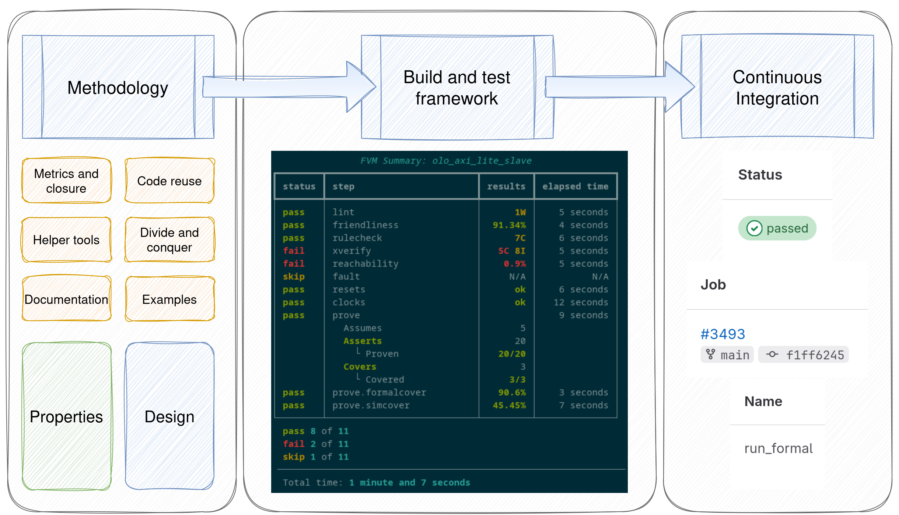
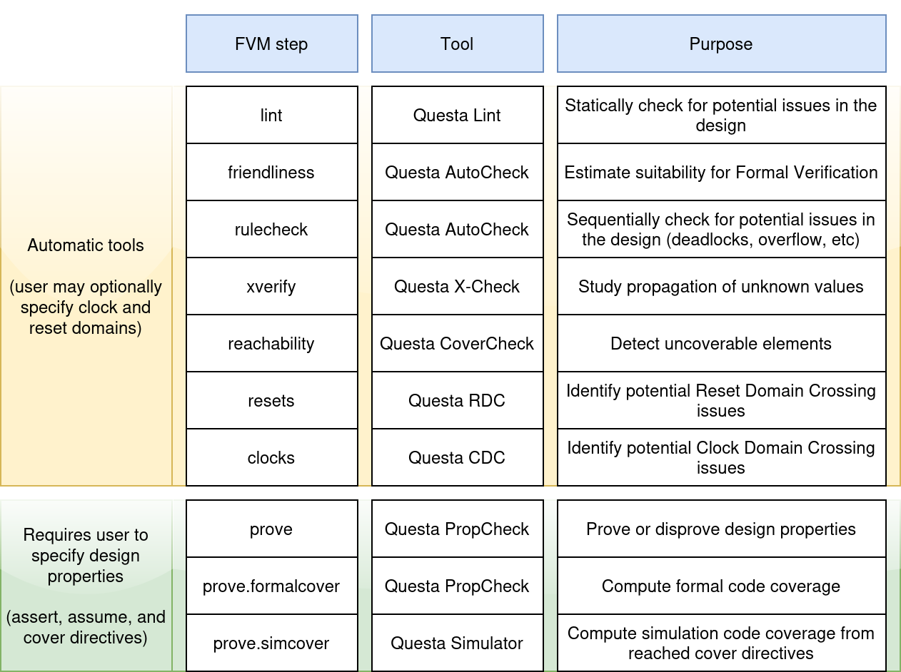

.. _fvm_intro:

What is FVM?
======================================

FVM is a **Formal Verification Methodology** for *digital microelectronics*. Its
main objective is to **lower the adoption barriers for Formal Verification for
the European Space Sector**, although it can be used in many other contexts where
digital design and/or verification is performed, such as teaching, research,
avionics, automotive, etc.

Its development is funded by the European Space Agency, through its Open Space
Innovation Program, specifically the activity *"Lowering the adoption barriers
for Formal Verification of ASIC and FPGA designs in the space sector"*. The
activity is being implemented by Universidad de Sevilla (Spain), through its
affiliated Technology Centre AICIA (Asociación de Investicación y Cooperación
Industrial de Andalucía).

The FVM is available under the permissive free/open-source license `Apache License 2.0
<https://opensource.org/licenses/Apache-2.0>`_

Components
----------------------------

The different parts of the FVM are:

- A defined methodology, with detailed steps.
- Helper tools that reduce the learning curve and effort required to write
  the formal properties
- A build and test framework that acts as an abstraction layer to interface
  with the software tools, generates XML files for Continuous Integration
  systems, and creates reports.
- A repository of examples, in increasing order of difficulty, that serve to
  introduce the concepts of the FVM gradually, with self-sustaining examples
  that can be studied and understood incrementally.
- Documentation and training materials to help new users understand both formal
  verification in general, and the FVM. You are reading those :)

A graphical summary of the FVM can be found below:

The methodology steps
~~~~~~~~~~~~~~~~~~~~~

As FVM is a methodology, it starts by defining a number of steps to perform:

The steps can be organized as follows:

- Leverage any available automated tools
- Create properties for the design under verification, leveraging the provided
  helper tools
- Run a model checking / property checking tool to prove or disprove the
  defined properties
- Generate reports and coverage metrics, including simulation metrics for
  traces generated in the previous step

The diagram below expands the list, since there are many automated tools
available:

The build and test framework
~~~~~~~~~~~~~~~~~~~~~~~~~~~~

The *FVM framework* acts as an abstraction layer that interfaces with the
formal tools. Each formal tool may require different configurations and
commands, and FVM manages that for you, while also providing sensible defaults
for tool options.

The user just writes a simple ``formal.py`` script like the following one:

.. literalinclude:: ../../../examples/countervunit/formal.py
   :language: python

When running the script (``python3 formal.py``), the framework
automatically calls the different formal tools, collects the relevant metrics,
and generates the reports.

Supported toolchains
^^^^^^^^^^^^^^^^^^^^

Currently, just the Questa Formal Tools (and Questa Simulator, for the
`simcover` step) are supported

The following table relates each FVM step with the relevant Questa tool

.. list-table:: FVM and the Questa toolchain
   :widths: 25 25
   :header-rows: 1

   * - FVM step
     - Questa tool
   * - ``lint``
     - Lint
   * - ``friendliness``
     - AutoCheck
   * - ``ruleCheck``
     - AutoCheck
   * - ``xverify``
     - X-Check
   * - ``reachability``
     - CoverCheck
   * - ``resets``
     - RDC
   * - ``clocks``
     - CDC
   * - ``prove``
     - PropCheck
   * - ``prove.formalcover``
     - PropCheck
   * - ``prove.simcover``
     - QuestaSim

Drom2psl
~~~~~~~~

``drom2psl`` is a package provided with FVM that aims to reduce the learning
curve and necessary effort to define formal properties.

From a `Wavedrom <https://wavedrom.com>`_ `.json` file, sequences are
extracted, even with parameters.

For example, from the following `.json` file:

.. code-block::

   {
   head: {text: 'wb_classic_read(addr, data)',
       tick:  0,
       every: 1,
       },
   foot: {text: 'Wishbone read, classic mode',
       },
   signal: [
       {name: 'clk',   wave: 'p|.|'},
     ['Master',
       {name: 'adr', wave: 'x3.x', data: 'addr', type: 'std_ulogic_vector(31 downto 0)'},
       {name: 'dat', wave: 'x...'},
       {name: 'cyc', wave: '01.0'},
       {name: 'stb', wave: '01.0'},
       {name: 'sel', wave: 'x...'},
       {name: 'we',  wave: 'x0.x'}
     ],
   {},
     ['Slave',
       {name: 'dat', wave: 'x.3x', data: 'data', type: 'std_ulogic_vector(31 downto 0)'},
       {name: 'ack', wave: '0.10'},
       {name: 'err', wave: '0...'}
     ],
   ],
 }

Which corresponds to the following waveform diagram:

.. image:: _static/wishbone_classic_read.svg
   :alt: A graphical summary of the FVM
   :width: 50%
   :align: center

The following PSL file is generated:

.. code-block::

   vunit wishbone_classic_read {

     sequence wishbone_classic_read_Master (
       hdltype std_ulogic_vector(31 downto 0) addr
     ) is {
       ((Master.cyc = '0') and (Master.stb = '0'))[*1]  -- 1 cycle;
       ((Master.adr = addr) and (Master.cyc = '1') and (Master.stb = '1') and (Master.we = '0'))[+]  -- 1 or more cycles;
       ((Master.cyc = '0') and (Master.stb = '0'))[*]  -- 0 or more cycles
     };

     sequence wishbone_classic_read_Slave (
       hdltype std_ulogic_vector(31 downto 0) data
     ) is {
       ((Slave.ack = '0') and (Slave.err = '0'))[+]  -- 1 or more cycles;
       ((Slave.dat = data) and (Slave.ack = '1') and (Slave.err = '0'))[*1]  -- 1 cycle;
       ((Slave.ack = '0') and (Slave.err = '0'))[*]  -- 0 or more cycles
     };

   }

Repository of examples
~~~~~~~~~~~~~~~~~~~~~~

To ease the learning curve, Formal Verification of multiple designs are
provided. These designs are ordered so the FVM can be learn by working through
them. See :ref:`examples` for more information.

